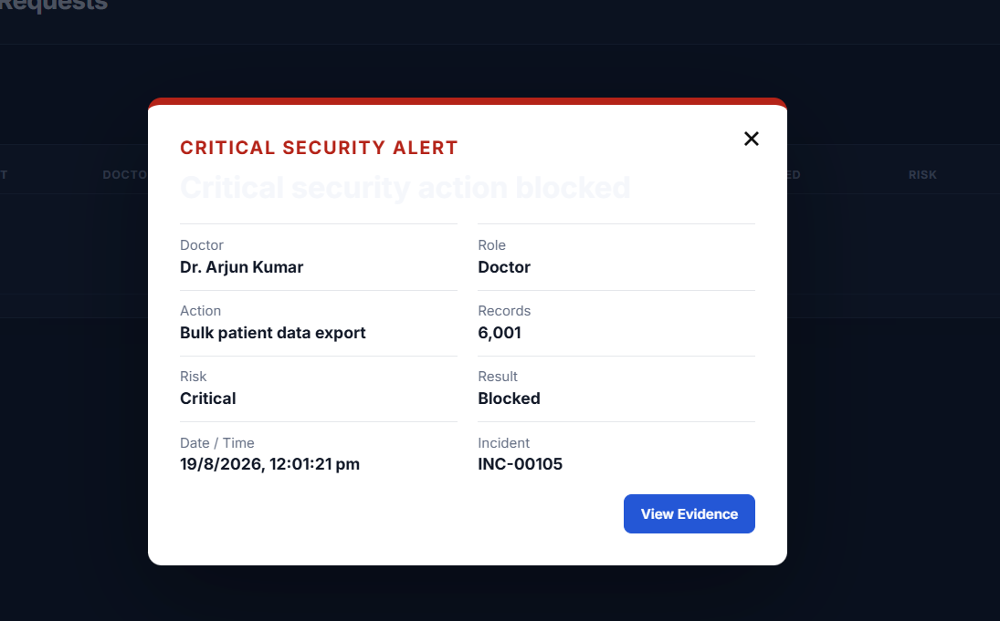
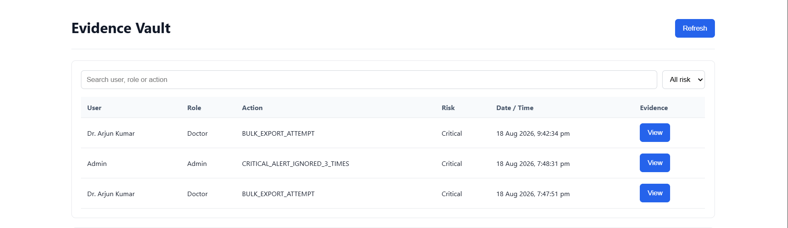

# WECARE--THREAT-DETECTION-WITH-0-TRUST<p align="center">
  <strong>Intelligent Healthcare Data Protection through Behavioral AI, Zero Trust and Insider-Threat Detection</strong>
</p>

<p align="center">
  Healthcare Security • Behavioral Analytics • Zero Trust • Insider Threat Detection • Digital Evidence
</p>

---

# WeCare

> **Protect care. Verify intent. Detect abnormal behavior. Preserve evidence.**

WeCare is a healthcare security platform designed to protect sensitive patient information from **insider threats, abnormal access patterns, unauthorized exports, and unsafe administrative decisions**.

Traditional healthcare systems often trust users after successful authentication.

WeCare takes a different approach:

> **Authentication gives access, but behavior determines trust.**

The platform combines:

- Hospital workflow management
- Behavioral anomaly detection
- Isolation Forest machine learning
- Zero Trust authorization
- Low-and-slow data exfiltration detection
- Real-time security communication
- Administrative accountability
- Automated incident containment
- Digital evidence preservation

---

# The Problem

Healthcare systems store highly sensitive information such as:

- Patient histories
- Laboratory reports
- Medical scans
- Diagnoses
- Prescriptions
- Medical records

Traditional access control mainly answers:

> **“Is this user authorized to access the system?”**

But insider-threat protection requires another question:

> **“Is this authorized user still behaving normally?”**

A legitimate Doctor account could still:

- access unusually large numbers of patient records
- repeatedly export small batches of data
- use unfamiliar devices
- work at unusual hours
- access unexpected departments
- attempt bulk extraction of patient information

WeCare was designed to detect these patterns without blocking legitimate clinical work.

---

# Core Security Philosophy

WeCare follows one key principle:

## Never trust an action only because the account is trusted.

Every sensitive action can be evaluated using:

```text
Identity
   +
Role
   +
Current Action
   +
Historical Behaviour
   +
Export Volume
   +
Recent Activity
   +
Authorization Context
   ↓
Security Decision
```

This creates a **behavior-aware Zero Trust healthcare environment**.

---

# What Makes WeCare Different?

WeCare combines three security layers.

### 1. Behavioral Intelligence

Machine learning evaluates whether current healthcare-worker behavior resembles normal historical activity.

### 2. Intent-Aware Authorization

Sensitive exports require a legitimate purpose, while larger or suspicious operations require additional approval.

### 3. Privileged-User Accountability

Doctors are monitored for suspicious data access, but Administrators are also monitored if they repeatedly override High or Critical security warnings.

Security therefore applies to **everyone with access to sensitive healthcare data**.

---

# System Overview

WeCare consists of three major operational areas:

### Doctor Workspace

Provides clinical access to patient information while enforcing behavioral and export-security controls.

### Administrator Security Console

Provides hospital administration, approval workflows, threat monitoring, incident investigation, and security communication.

### Evidence Vault

Stores preserved digital evidence from Critical security incidents for later investigation.

---

# Major Features

| Healthcare Operations | Security Controls | Intelligent Detection |
|---|---|---|
| Patient Reports | Zero Trust Export Control | Isolation Forest |
| Laboratory Reports | Purpose-Based Authorization | Behavioral Anomaly Detection |
| Scan Reports | Admin Approval Workflow | Risk Classification |
| Medical Records | Bulk Export Blocking | Low-and-Slow Detection |
| Doctor Schedule | Session Restriction | Behavioral Baseline |
| Admin Management | Evidence Preservation | Security Risk Profile |

---

# Doctor Dashboard

The Doctor Dashboard provides access to clinical information while continuously enforcing security policy.

Available modules include:

- My Schedule
- Patient Reports
- Laboratory Reports
- Scan Reports
- Medical Records
- Security Inbox

Doctors can perform normal clinical operations while high-risk actions receive additional verification.

---

# Scan Report Viewer

The Scan Reports section contains the existing hospital scan dataset together with a **Cardiac Report**.

The Cardiac Report is stored as **one medical record containing five pages**.

When opened, all five pages appear inside one vertically scrollable viewer.

<p align="center">
  
</p>

```text
Scan Reports
│
├── Cardiac Report
│      ├── Page 1
│      ├── Page 2
│      ├── Page 3
│      ├── Page 4
│      └── Page 5
│
├── Existing Scan Record
├── Existing Scan Record
└── ...
```

The original scan dataset remains available.

---

# Secure Patient Data Export

WeCare treats patient-data export as a sensitive operation.

Export decisions consider:

- number of selected records
- export purpose
- recent export activity
- cumulative record volume
- previous export requests
- approval history
- behavioral risk

---

## Small Export — 1 to 10 Records

A Doctor must provide an authorization reason before exporting.

Possible reasons include:

- clinical review
- patient handover
- audit
- research
- legal requirement
- approved administrative purpose

Successful exports are logged.

---

## Medium Export — 11 to 50 Records

The operation is not immediately downloaded.

Instead:

```text
Doctor selects records
        │
        ▼
Provides export purpose
        │
        ▼
Export Request Created
        │
        ▼
Administrator Review
     ┌──┴──┐
     ▼     ▼
 Approve  Reject
     │     │
     ▼     ▼
Download  Reason returned
enabled   to Doctor
```

Each request receives an identifier such as:

```text
EXP-00001
```

The Doctor receives the final approval or rejection decision live.

---

# Low-and-Slow Exfiltration Detection

An insider may avoid one large export by repeatedly downloading smaller batches.

Example:

```text
Day 1 → 3 patient records
Day 2 → 3 patient records
Day 3 → 3 patient records
Day 4 → additional export attempt
```

Each individual transaction may appear harmless.

WeCare correlates them across time.

The platform evaluates:

- number of recent export transactions
- cumulative records exported
- previous approval requests
- current record selection
- rolling seven-day activity

This allows WeCare to detect **slow data exfiltration**, not only obvious bulk downloads.

---

# Critical Bulk Export Protection

Extreme bulk-export behavior is treated as a Critical security incident.

```text
Bulk Export Attempt
        │
        ▼
Critical Security Decision
        │
        ▼
Export Blocked
        │
        ▼
Evidence Preserved
        │
        ▼
Administrator Notified
        │
        ▼
Session Terminated
```

The Doctor cannot obtain the protected information through the blocked operation.

### Critical Incident Example

<p align="center">
  
</p>

The alert provides the Administrator with important incident information such as:

- Doctor
- Role
- Action
- Number of records
- Risk level
- Result
- Date / time
- Incident identifier

---

# Artificial Intelligence

WeCare uses **Isolation Forest** for behavioral anomaly detection. :contentReference[oaicite:1]{index=1}

Isolation Forest is an:

- unsupervised learning algorithm
- anomaly-detection algorithm
- tree-based model
- ensemble-learning technique

It is designed to identify behavior that differs significantly from a healthcare worker's normal activity.

---

## Behavioral Features

The model can evaluate information such as:

```text
Login Time
Session Duration
Records Viewed
Downloads
Departments Accessed
Failed Authentication Attempts
Unknown Device Activity
External Network Activity
After-Hours Activity
Bulk Export Behaviour
```

---

# AI Detection Workflow

```text
Healthcare Worker Activity
           │
           ▼
     Feature Extraction
           │
           ▼
 Historical Behaviour Baseline
           │
           ▼
     Isolation Forest
           │
           ▼
      Anomaly Score
           │
           ▼
      Risk Evaluation
           │
    ┌──────┼──────┬─────────┐
    ▼      ▼      ▼         ▼
   Low   Medium   High    Critical
```

Normal behavior remains close to the learned baseline.

Unusual combinations of activity receive a higher anomaly score.

---

# Hybrid AI + Zero Trust Security

Machine learning does not make every security decision by itself.

WeCare deliberately combines:

```text
Machine Learning
       +
Security Policies
       +
Historical Activity
       +
Authorization
       =
Final Security Response
```

### Machine Learning detects

- unusual behavior
- abnormal access patterns
- behavioral deviation
- suspicious combinations of activity

### Zero Trust rules enforce

- export authorization
- approval requirements
- cumulative export limits
- critical-operation blocking
- session restriction
- administrative escalation

This hybrid approach provides predictable enforcement while still benefiting from behavioral intelligence.

---

# Security Risk Spider Profile

The Administrator dashboard provides a radar/spider visualization of the current behavioral security environment.

The graph includes:

- Record Access
- Downloads
- Behavior Deviation
- Medium+ Risk
- High+ Risk
- Critical Exposure

The chart gives Administrators a quick overview of current behavioral risk.

---

# Real-Time Security Communication

WeCare uses **Socket.IO** to deliver security events without requiring page refreshes. :contentReference[oaicite:2]{index=2}

Real-time events can include:

- export approval requests
- export approval decisions
- export rejection decisions
- Doctor security notices
- live Administrator messages
- Critical incident notifications
- session restriction events
- escalation events

Administrators can send a notice and the Doctor receives it as a **live popup** on the Doctor Dashboard.

The Security Inbox also preserves communication for later review.

## Live Security Alert Demo

<p align="center">
  
</p>

The GIF can demonstrate:

```text
Suspicious Doctor Activity
        ↓
Security Event Generated
        ↓
Administrator Alerted
        ↓
Live Security Popup Appears
```

---

# Administrator Accountability

Administrators are not automatically treated as harmless privileged users.

Consider this scenario:

```text
Doctor generates suspicious export request
                │
                ▼
        Risk Level: High
                │
                ▼
      Administrator receives warning
                │
                ▼
         "Approve Anyway"
```

One override may have a legitimate explanation.

Repeated unsafe overrides can indicate an administrative insider threat.

---

# Administrative Risk Escalation

WeCare records unsafe High/Critical approval overrides.

```text
First Unsafe Override
        │
        ▼
Medium Administrative Risk

Second Unsafe Override
        │
        ▼
High Administrative Risk

Third Unsafe Override
        │
        ▼
Critical Administrative Incident
        │
        ├── Evidence Preserved
        ├── Account Restricted
        ├── Session Terminated
        └── Higher Official Notified
```

This creates accountability on both sides of the approval workflow.

---

# Evidence Vault

Critical security incidents can preserve digital evidence for investigation. :contentReference[oaicite:3]{index=3}

Evidence may include:

- Screenshot
- Session Replay
- Security Timeline
- Incident Metadata
- Page Snapshot
- Evidence Manifest

<p align="center">
  
</p>

The Evidence Vault provides investigators with a searchable view of preserved Critical incidents.

Displayed information can include:

- User
- Role
- Action
- Risk
- Date / Time
- Evidence access

---

## Evidence Investigation Demo

<p align="center">
  
</p>

The GIF can demonstrate:

```text
Critical Incident
      ↓
Open Evidence Vault
      ↓
Select Incident
      ↓
View Screenshot
      ↓
Review Timeline
      ↓
Replay Session
```

---

# Evidence Visibility

Evidence access is deliberately separated.

### Doctor Evidence

Appropriate Doctor incident evidence may be viewed by an Administrator during investigation.

### Administrator Evidence

Evidence generated from suspicious Administrator behavior is preserved inside the **Evidence Vault**.

The normal Admin Dashboard does not expose internal Administrator evidence identifiers or direct Admin-evidence controls.

This separation helps preserve investigation integrity.

---

# Automated Incident Response

WeCare can automatically respond when risk reaches a Critical level.

```text
Detect
  ↓
Classify
  ↓
Block
  ↓
Capture Evidence
  ↓
Notify
  ↓
Restrict Account
  ↓
Terminate Session
  ↓
Escalate
```

The goal is not simply to display a warning.

WeCare demonstrates:

> **Detection + Containment + Investigation**

---

# Administrator Dashboard

The Administrator interface includes:

- Dashboard
- Doctors
- Patients
- Reception
- Laboratory
- Pharmacy
- Medical Records
- Export Requests
- Threat Monitoring
- Security Notices
- AI Security Operations Center

Administrators can monitor clinical activity and security operations from one interface.

---

# AI Security Operations Center

The AI Security Operations Center provides visibility into behavioral detections.

Information can include:

- prediction
- anomaly score
- confidence
- risk classification
- behavioral explanation
- recent security activity
- incident information

This allows Administrators to understand **why an activity was considered suspicious**, rather than receiving only an unexplained alert.

---

# Overall Architecture

```text
                         WECARE PLATFORM
                                │
          ┌─────────────────────┴─────────────────────┐
          │                                           │
          ▼                                           ▼
   Doctor Dashboard                          Admin Dashboard
          │                                           │
          └─────────────────────┬─────────────────────┘
                                │
                                ▼
                    Authentication / JWT Layer
                                │
                                ▼
                     Zero Trust Policy Engine
                                │
                     ┌──────────┴──────────┐
                     │                     │
                     ▼                     ▼
              Behavioral Data       Export Activity
                     │                     │
                     └──────────┬──────────┘
                                ▼
                       Isolation Forest
                                │
                                ▼
                      Risk Classification
                                │
             ┌──────────────────┴──────────────────┐
             │                                     │
             ▼                                     ▼
       Normal Activity                      Suspicious Activity
             │                                     │
             ▼                                     ▼
      Continue Workflow                   Security Response
                                                   │
                         ┌─────────────────────────┼─────────────┐
                         ▼                         ▼             ▼
                   Admin Review              Evidence Vault   Containment
```

---

# Technology Stack

| Layer | Technology |
|---|---|
| Backend | Node.js, Express.js |
| Frontend | HTML5, CSS3, Vanilla JavaScript |
| Database | SQLite |
| Real-Time Communication | Socket.IO |
| Authentication | JWT |
| Password Security | bcrypt |
| Machine Learning | Isolation Forest |
| Session Evidence | rrweb |
| Screenshot Evidence | html2canvas |
| Security Architecture | Zero Trust |
| Version Control | Git & GitHub |

---

# Project Structure

```text
WeCare
│
├── public/
│   ├── css/
│   ├── js/
│   ├── assets/
│   ├── doctor-dashboard.html
│   └── admin-dashboard.html
│
├── routes/
│   ├── authRoutes.js
│   ├── communicationRoutes.js
│   └── mlRoutes.js
│
├── services/
│   ├── isolationForest.js
│   ├── mlService.js
│   ├── evidenceService.js
│   ├── activityService.js
│   ├── sessionService.js
│   └── socketService.js
│
├── middleware/
│   └── authMiddleware.js
│
├── evidence-vault-public/
│
├── assets/
│   ├── doctor-dashboard.png
│   ├── critical-security-alert.png
│   ├── evidence-vault.png
│   ├── live-security-alert.gif
│   └── evidence-vault-demo.gif
│
├── evidenceVaultServer.js
├── server.js
├── package.json
└── README.md
```

---

# Demonstration Scenarios

## Scenario 1 — Legitimate Small Export

```text
Doctor selects a few records
        ↓
Provides legitimate purpose
        ↓
Policy evaluates request
        ↓
Export permitted
        ↓
Activity logged
```

---

## Scenario 2 — Medium Export

```text
Doctor selects 11–50 records
        ↓
Admin approval required
        ↓
Request appears in Export Requests
        ↓
Admin Approves / Rejects
        ↓
Doctor receives live decision
```

---

## Scenario 3 — Low-and-Slow Export

```text
Small Export
     ↓
Small Export
     ↓
Small Export
     ↓
Activity Correlation
     ↓
Suspicious Pattern Detected
     ↓
Future Export Requires Approval
```

---

## Scenario 4 — Critical Bulk Export

```text
Doctor attempts extreme bulk export
        ↓
Critical Risk
        ↓
Operation Blocked
        ↓
Evidence Captured
        ↓
Admin Alerted
        ↓
Doctor Session Terminated
```

---

## Scenario 5 — Unsafe Administrator

```text
High/Critical Request
        ↓
Admin chooses Approve Anyway
        ↓
Repeated unsafe decisions detected
        ↓
Administrative risk increases
        ↓
Critical Admin Incident
        ↓
Evidence preserved
        ↓
Account restricted
        ↓
Higher Official escalation
```

---

# Running Locally

## Install Dependencies

```bash
npm install
```

## Start WeCare

```bash
npm start
```

Main application:

```text
http://localhost:80
```

Evidence Vault:

```text
http://localhost:8080
```

---

# Security Design Principles

WeCare was built around five principles.

### 01 — Authentication is not permanent trust

A valid account can still behave maliciously.

### 02 — Small actions can create a large threat

Repeated small exports must be correlated over time.

### 03 — Legitimate operations should remain possible

Security should require justification or approval rather than blindly blocking every export.

### 04 — Privileged users require accountability

Administrators can also become insider threats.

### 05 — Critical decisions require evidence

Security incidents should leave a reliable investigation trail.

---

# Project Objective

WeCare demonstrates a healthcare security architecture capable of continuously answering three questions:

```text
WHO is performing the action?

WHAT are they attempting to do?

DOES their behaviour still deserve trust?
```

By combining **healthcare operations, Zero Trust policies, Isolation Forest behavioral analysis, real-time incident response, and digital evidence preservation**, WeCare demonstrates a practical approach to protecting patient information against modern insider threats.

---

# Future Enhancements

Possible future improvements include:

- Role-specific behavioral models
- Federated learning across hospital departments
- Advanced device fingerprinting
- SIEM integration
- Automated threat-intelligence correlation
- Explainable AI dashboards
- Risk-adaptive authentication
- Hardware-backed evidence signing
- Multi-hospital security federation
- Advanced patient-privacy analytics

---

# Academic Purpose

WeCare is developed as an **academic and cybersecurity demonstration project**.

The project demonstrates concepts related to:

- Healthcare cybersecurity
- Insider-threat detection
- Zero Trust Architecture
- Behavioral analytics
- Machine learning
- Incident response
- Digital forensics
- Privileged-user accountability

---

<p align="center">

### WeCare

**Healthcare needs more than trusted accounts. It needs trusted behaviour.**

</p>
